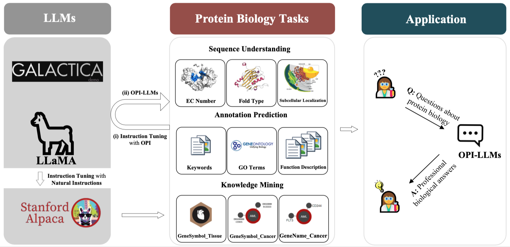

<div align="center">


[](https://github.com/tatsu-lab/stanford_alpaca/blob/main/LICENSE)
[](https://github.com/tatsu-lab/stanford_alpaca/blob/main/DATA_LICENSE)
[](https://github.com/tatsu-lab/stanford_alpaca/blob/main/WEIGHT_DIFF_LICENSE)

# <center> PI: An Open Instruction Dataset for Adapting Large Language Models to Protein-Related Tasks

</div>

**VISION & ROADMAP.** *Open Protein Instructions(OPI) is the initial part of Open Biology Instructions(OBI) project, together with the subsequent Open Molecule Instructions(OMI), Open DNA Instructions(ODI), Open RNA Instructions(ORI) and Open Single-cell Instructions (OSCI). OBI is a project which aims to fully leverage the potential ability of Large Language Models(LLMs), especially the scientific LLMs like Galactica, to facilitate research in AI for Life Science community. While OBI is still in an early stage, we hope to provide a starting point for the community to bridge LLMs and biological domain knowledge.*


## Overview
This repo is for the **Open Protein Instructions (OPI)** project, aiming to build and release a protein instruction dataset as well as propose to explore and benckmark LLMs for protein modeling in protein biology.
<!--  -->
<div align="center">

</div>

**Usage and License Notices:** [LLaMA](https://github.com/facebookresearch/llama) and [Galactica](https://github.com/paperswithcode/galai) are intended and licensed for research use only. The dataset is CC BY NC 4.0 (allowing only non-commercial use) and models trained using the dataset should not be used outside of research purposes. The weight diff for [Stanford Alpaca](https://github.com/tatsu-lab/stanford_alpaca) is also CC BY NC 4.0 (allowing only non-commercial use).

## Dataset Update
The previous version of OPI dataset is based on the **release 2022_01** of UniProtKB/Swiss-Prot protein knowledgebase. At current, OPI is updated to contain the latest **release 2023_05**, which can be accessed via the dataset file [OPI_updated_160k.json](https://huggingface.co/datasets/BAAI/OPI/blob/main/OPI_DATA/OPI_updated_160k.json) from Huggingface.

Reference:
- https://ftp.uniprot.org/pub/databases/uniprot/previous_releases/release-2022_01/knowledgebase/UniProtKB_SwissProt-relstat.html
- https://ftp.uniprot.org/pub/databases/uniprot/previous_releases/release-2023_05/knowledgebase/UniProtKB_SwissProt-relstat.html

## OPI dataset construction pipeline
The OPI dataset is curated on our own by extracting key information from [Swiss-Prot](https://www.uniprot.org/uniprotkb?facets=reviewed%3Atrue&query=%2A) database. The detailed construction pipeline is depicted in the supplementary material of our [manuscript](https://openreview.net/forum?id=ecnshnvES6) which has been submitted to [NeurIPS 2023 Datasets and Benchmarks Track](https://nips.cc/Conferences/2023/CallForDatasetsBenchmarks). The following figure shows the general construction process.

<!--  -->
<div align="center">

</div>


- **An example of OPI training data:**
```
instruction: 
    What is the EC classification of the input protein sequence based on its biological function?
input:                         
    MGLVSSKKPDKEKPIKEKDKGQWSPLKVSAQDKDAPPLPPLVVFNHLTPPPPDEHLDEDKHFVVALYDYTAMNDRDLQMLKGEKLQVLKGTGDWWLARS
    LVTGREGYVPSNFVARVESLEMERWFFRSQGRKEAERQLLAPINKAGSFLIRESETNKGAFSLSVKDVTTQGELIKHYKIRCLDEGGYYISPRITFPSL
    QALVQHYSKKGDGLCQRLTLPCVRPAPQNPWAQDEWEIPRQSLRLVRKLGSGQFGEVWMGYYKNNMKVAIKTLKEGTMSPEAFLGEANVMKALQHERLV
    RLYAVVTKEPIYIVTEYMARGCLLDFLKTDEGSRLSLPRLIDMSAQIAEGMAYIERMNSIHRDLRAANILVSEALCCKIADFGLARIIDSEYTAQEGAK
    FPIKWTAPEAIHFGVFTIKADVWSFGVLLMEVVTYGRVPYPGMSNPEVIRNLERGYRMPRPDTCPPELYRGVIAECWRSRPEERPTFEFLQSVLEDFYT
    ATERQYELQP
output: 
    2.7.10.2
```

## OPI dataset release
We release the first curated OPI dataset corresponding to the 9 evaluation tasks to facilitate further research in protein biology domain. We are warmly welcome further improvenmet or supplement to this dataset.

**How to access the OPI dataset?** The OPI dataset can be accessed via this link [OPI_DATA](https://huggingface.co/datasets/BAAI/OPI) from HuggingFace.
Once finished downloading the **OPI_DATA** dataset, please put the three subfolders, i.e., AP, KM and SU, into the **OPI_DATA** folder in this repo. 

The **OPI dataset folder structure** is as follows:
```
./OPI_DATA/
├── AP
│   ├── Function
│   │   ├── test
│   │   │   ├── CASPSimilarSeq_function_test.jsonl
│   │   │   ├── IDFilterSeq_function_test.jsonl
│   │   │   └── UniProtSeq_function_test.jsonl
│   │   └── train
│   │       ├── function_description_train.json
│   │       └── function_description_train_0.01.json
│   ├── GO
│   │   ├── test
│   │   │   ├── CASPSimilarSeq_go_test.jsonl
│   │   │   ├── IDFilterSeq_go_test.jsonl
│   │   │   └── UniProtSeq_go_test.jsonl
│   │   └── train
│   │       ├── go_terms_train.json
│   │       └── go_terms_train_0.01.json
│   └── Keywords
│       ├── test
│       │   ├── CASPSimilarSeq_keywords_test.jsonl
│       │   ├── IDFilterSeq_keywords_test.jsonl
│       │   └── UniProtSeq_keywords_test.jsonl
│       └── train
│           ├── keywords_train.json
│           └── keywords_train_0.01.json
├── KM
│   ├── gSymbol2Cancer
│   │   ├── test
│   │   │   └── gene_symbol_to_cancer_test.jsonl
│   │   └── train
│   │       └── gene_symbol_to_cancer_train.json
│   ├── gName2Cancer
│   │   ├── test
│   │   │   └── gene_name_to_cancer_test.jsonl
│   │   └── train
│   │       └── gene_name_to_cancer_train.json
│   └── gSymbol2Tissue
│       ├── test
│       │   └── gene_symbol_to_tissue_test.jsonl
│       └── train
│           └── gene_symbol_to_tissue_train.json
└── SU
    ├── EC_number
    │   ├── test
    │   │   ├── CLEAN_EC_number_new_test.jsonl
    │   │   └── CLEAN_EC_number_price_test.jsonl
    │   └── train
    │       ├── CLEAN_EC_number_train.json
    ├── Fold_type-Remote
    │   ├── test
    │   │   └── Remote_test.jsonl
    │   └── train
    │       └── Remote_train.json
    └── Subcellular_location
        ├── test
        │   ├── location_test.jsonl
        └── train
            └── location_train.json
```

The **OPI_DATA** folder contains 9 protein tasks seperately. If you want to merge all or several 'train.json' files of the nine tasks into one single file, please do like this:
```
cd OPI_DATA
python merge_nine_opi_tasks_train.py --output OPI_merged.json
```
You can access the whole dataset file [OPI_full_1.46M.json](https://huggingface.co/datasets/BAAI/OPI) from HuggingFace, which contains 1.46 million examples.

## OPI-instruction tuning from original Galactica-6.7B model and LLaMA-7B model
For OPI-instruction tuning, we adopt the training script of [Stanford Alpaca](https://github.com/tatsu-lab/stanford_alpaca). 

### 1. Galactica instruction-tuning with OPI

[Example: train_keywords.sh](./train_galai/train_keywords.sh)
```
#!/bin/bash

OMP_NUM_THREADS=1 torchrun --nnodes=$1 --node_rank=$2 --nproc_per_node=3 train_galai/train.py \
    --model_name_or_path path/to/galactica_base_model/galactica-$3 \
    --data_path  ./OPI_DATA/AP/Keywords/train/keywords_train.json \
    --bf16 True \
    --output_dir path/to/output/galai_ft_opi/galai_ft_keywords_$3_e$4 \
    --num_train_epochs $4 \
    --per_device_train_batch_size 4 \
    --per_device_eval_batch_size 4 \
    --gradient_accumulation_steps 8 \
    --evaluation_strategy "no" \
    --save_strategy "steps" \
    --save_steps 2000 \
    --save_total_limit 1 \
    --learning_rate 2e-5 \
    --weight_decay 0. \
    --warmup_ratio 0.03 \
    --deepspeed "./configs/default_offload_opt_param.json" \
    --tf32 True
```

In the Shell above, you can setup your onw local LLM weights path or Huggingface model entry (e.g., *facebook/galactica-6.7b*) to ```model_name_or_path```  and you onw training results saving path to ```output_dir```.

To start training, please do like this:
```
bash train_galai/train_keywords.sh 1 0 6.7b 3 
```

Explanation of such bash arguments:
```
1: nnodes \
0: node_rank \
6.7b: model size of Galactica \
3: total training epochs
```

### 2. LLaMA instruction-tuning with OPI

[Example: train_EC_number.sh](./train_llama/train_EC_number.sh)
```
#!/bin/bash

OMP_NUM_THREADS=1 torchrun --nnodes=$1 --node_rank=$2 --nproc_per_node=3 train_llama/train.py \
    --model_name_or_path path/to/llama_base_model/hf_version/llama-$3 \
    --data_path  ./OPI_DATA/SU/EC_number/train/CLEAN_EC_number_train.json \
    --bf16 True \
    --output_dir path/to/output/llama_ft_CLEAN_EC_number_$3_e$4 \
    --num_train_epochs $4 \
    --per_device_train_batch_size 4 \
    --per_device_eval_batch_size 4 \
    --gradient_accumulation_steps 16 \
    --evaluation_strategy "no" \
    --save_strategy "steps" \
    --save_steps 2000 \
    --save_total_limit 1 \
    --learning_rate 2e-5 \
    --weight_decay 0. \
    --warmup_ratio 0.03 \
    --deepspeed "./configs/default_offload_opt_param.json" \
    --tf32 True
```
In the Shell above, you can setup your onw local LLM weights path or Huggingface model entry (e.g., *decapoda-research/llama-7b-hf*) to ```model_name_or_path```  and you onw training results saving path to ```output_dir```.
To start training, please do like this:
```
bash train_llama/train_EC_number.sh 1 0 7b 3 
```

Explanation of such bash arguments:
```
1: nnodes \
0: node_rank \
7b: model size of LLaMA \
3: total training epochs
```

**Note**: As for the training, we take the suggestion to address out-of-memory issue from [tatsu-lab/stanford_alpaca](https://github.com/tatsu-lab/stanford_alpaca), using DeepSpeed ZeRO stage-3 with offload.

### 3. Convert DeepSpeed-format weights
Once finished instruction tuning, the DeepSpeed-format weights should be converted to **pytorch_model.bin**, using the following script:
```
cd output_dir
python zero_to_fp32.py . pytorch_model.bin
```

### 4. How to access OPI-instruction-tuned Galactica-6.7B model?
In this repo, we release the OPI_full_Galactica-6.7B model which is fine-funed on OPI full dataset, which can be accessed from [HuggingFace](https://huggingface.co/BAAI/OPI_full_Galactica-6.7B). Please feel free to contact us if there is any question.

## OPEval: Nine Evaluation tasks

For benchamarking, we design OPEval consisting of 3 types of evaluation tasks, each of which contains 3 specific ones, as shown in the following table.

|       Task Type        | Abbreviation |                  Task Name                  |
| :--------------------: | :----------: | :-----------------------------------------: |
| Sequence Understanding |      SU      |            EC Number Prediction             |
| Sequence Understanding |      SU      |            Fold Type Prediction             |
| Sequence Understanding |      SU      |     Subcellular Localization Prediction     |
| Annotation Prediction  |      AP      |        Function Keywords Prediction         |
| Annotation Prediction  |      AP      |     Gene Ontology(GO) Terms Prediction      |
| Annotation Prediction  |      AP      |       Function Description Prediction       |
|    Knowledge Mining    |      KM      | Tissue Location Prediction from Gene Symbol |
|    Knowledge Mining    |      KM      |     Cancer Prediction from Gene Symbol      |
|    Knowledge Mining    |      KM      |      Cancer Prediction from Gene Name       |

## Evaluating various models with OPI data
### 1. Environment setup
```
pip install -r requirements.txt
```

As for the evaluation, we refer to the inference script from [Chinese-LLaMA-Alpaca](https://github.com/ymcui/Chinese-LLaMA-Alpaca).

### 2. Evaluation of Galactica
We evaluate OPI-instruction-tuned Galactica-6.7B model and origional Galactica-6.7B model.

**For OPI-instruction-tuned Galactica-6.7B model, please use the following script:**
```
cd eval_galai
python eval_galai.py --model_idx OPI-instruction-tuned-model-name --output_dir ./eval_galai_output --gpus=0
```
In the commands above, ```model_idx```is the model index you can allocate to your local LLM weights for you to easily access a LLM model when inferencing, which you can set it up in the [model_dict](eval_galai/eval_galai.py#L74) in [eval_galai.py](eval_galai/eval_galai.py#L74). ```output_dir```is where you save the evaluation results. 

**For the original Galactica-6.7B model, please use the following script:**
```
cd eval_galai/infer_with_original_galai
bash galactica_infer.sh
```

### 3. Evaluation of Alpaca
For comparison, we evaluate Alpaca-7B model and [Galpaca-6.7B](https://huggingface.co/GeorgiaTechResearchInstitute/galpaca-6.7b) model. The Galpaca-6.7B model is contributed by Georgia Tech Research Institute on HuggingFace.

As for Alpaca-7B model, we first get [alpaca-7b-wdiff](https://huggingface.co/tatsu-lab/alpaca-7b-wdiff) from HuggingFace, which is the weight diff for [Stanford Alpaca-7B](https://github.com/tatsu-lab/stanford_alpaca/), then recover the original Alpaca-7B weights using the conversion script provided by [tatsu-lab/stanford_alpaca](https://github.com/tatsu-lab/stanford_alpaca).

The same script is used for evaluating Alpaca-7B and Galpaca-6.7B model, just by setting a different model_idx for a different model.
```
cd eval_alpaca
python eval_alpaca.py --model_idx alpaca-7b-recover --output_dir ./eval_alpaca_output --gpus=0 #original Alpaca-7B weights
```
In the commands above, ```model_idx```is the model index you can allocate to your local LLM weights for you to easily access a LLM model when inferencing, which you can set it up in the [model_dict](eval_galai/eval_galai.py#L74) in [eval_alpaca.py](eval_alpaca/eval_alpaca.py#L81). ```output_dir```is where you save the evaluation results. 

### 4. Evaluation of LLaMA
For comparison, we evaluate OPI-instruction-tuned LLaMA-7B model and original LLaMA-7B model.

The same script is used for evaluating OPI-instruction-tuned LLaMA-7B model and original LLaMA-7B model, just by setting a different model_idx for a different model.
```
cd eval_llama
python eval_llama.py --model_idx llama_7b_hf --output_dir ./eval_llama_output --gpus=0  #original LLaMA-7B weights
```
In the commands above, ```model_idx```is the model index you can allocate to your local LLM weights for you to easily access a LLM model when inferencing, which you can set it up in the [model_dict](eval_galai/eval_galai.py#L74) in [eval_llama.py](eval_llama/eval_llama.py#L83). ```output_dir```is where you save the evaluation results. 

### 5. The following table shows evaluation results of OPI_full_Galactica-6.7B model on 9 tasks.
| Task Type              | Task Name                                   | Testing file                  | Accuracy | Precision | Recall |  F1   | Rouge-L |
| ---------------------- | ------------------------------------------- | ----------------------------- | :------: | :-------: | :----: | :---: | :-----: |
| Sequence Understanding | EC Number Prediction                        | CLEAN_EC_number_new_test      |    -     |   0.181   | 0.174  | 0.176 |    -    |
| Sequence Understanding | EC Number Prediction                        | CLEAN_EC_number_price_test    |    -     |   0.054   | 0.054  | 0.054 |    -    |
| Sequence Understanding | Fold Type Prediction                        | Remote_test_fold             |  0.068   |     -     |   -    |   -   |    -    |
| Sequence Understanding | Fold Type Prediction                        | Remote_test_superfamily      |  0.090   |     -     |   -    |   -   |    -    |
| Sequence Understanding | Fold Type Prediction                        | Remote_test_family           |  0.416   |     -     |   -    |   -   |    -    |
| Sequence Understanding | Subcellular Localization Prediction         | location_test                |  0.678   |     -     |   -    |   -   |    -    |
| Annotation Prediction  | Function Keywords Prediction                | CASPSimilarSeq_keywords_test |    -     |   0.716   | 0.669  | 0.674 |    -    |
| Annotation Prediction  | Function Keywords Prediction                | IDFilterSeq_keywords_test    |    -     |   0.822   | 0.771  | 0.778 |    -    |
| Annotation Prediction  | Function Keywords Prediction                | UniProtSeq_keywords_test     |    -     |   0.871   | 0.802  | 0.820 |    -    |
| Annotation Prediction  | Gene Ontology(GO) Terms Prediction          | CASPSimilarSeq_go_test       |    -     |   0.710   | 0.627  | 0.647 |    -    |
| Annotation Prediction  | Gene Ontology(GO) Terms Prediction          | IDFilterSeq_go_test          |    -     |   0.724   | 0.637  | 0.656 |    -    |
| Annotation Prediction  | Gene Ontology(GO) Terms Prediction          | UniProtSeq_go_test           |    -     |   0.759   | 0.683  | 0.698 |    -    |
| Annotation Prediction  | Function Description Prediction             | CASPSimilarSeq_function_test |    -     |     -     |   -    |   -   |  0.431  |
| Annotation Prediction  | Function Description Prediction             | IDFilterSeq_function_test    |    -     |     -     |   -    |   -   |  0.624  |
| Annotation Prediction  | Function Description Prediction             | UniProtSeq_function_test     |    -     |     -     |   -    |   -   |  0.696  |
| Knowledge Mining       | Tissue Location Prediction from Gene Symbol | gene_symbol_to_tissue_test   |    -     |   0.377   | 0.779  | 0.468 |    -    |
| Knowledge Mining       | Cancer Prediction from Gene Symbol          | gene_symbol_to_cancer_test    |    -     |   0.554   | 0.433  | 0.465 |    -    |
| Knowledge Mining       | Cancer Prediction from Gene Name            | gene_name_to_cancer_test      |    -     |   0.507   | 0.400  | 0.429 |    -    |

## Prediction by OPI_full_Galactica-6.7B/GPT-4/GPT-4-32k/GPT-3.5/LLaMA-2-13B-chat/Claude-2 v.s. Target

<div align="center">

</div>
<div align="center">

</div>
<div align="center">

</div>
<div align="center">

</div>
<div align="center">

</div>
<div align="center">

</div>
<div align="center">

</div>
<div align="center">

</div>
<div align="center">

</div>

<details>
<summary>Task 1: EC Number Prediction</summary>

```
Instruction:
    What is the EC number of the input sequence?
Input:
    MSLLAYTNLLLQNGRIFRYYKKANIKKFIKKIIKLDLKSTPSEASVSRQTFLSTGLNSVKNAVQLQARKLLINNVLERVTPTLNSDLKKKAAKRLFYGDSAPFFALVGVSLASGSGLLTKDDELEGICWEIREAVSKGKWNDSESENVEQLQAANLDELDLGEPIAKGCNAVVYSAKLKNVQSNKLAHQLAVKMMFNYDVESNSTAILKAMYRETVPAMSYFFNQNLFNIENISDFKIRLPPHPNIVRMYSVFADRIPDLQCNKQLYPEALPPRINPEGSGRNMSLFLVMKRYDCTLKEYLRDKTPNMRSSILLLSQLLEAVAHMNIHNISHRDLKSDNILVDLSEGDAYPTIVITDFGCCLCDKQNGLVIPYRSEDQDKGGNRALMAPEIANAKPGTFSWLNYKKSDLWAVGAIAYEIFNIDNPFYDKTMKLLSKSYKEEDLPELPDTIPFIIRNLVSNMLSRSTNKRLDCDVAATVAQLYLWAPSSWLKENYTLPNSNEIIQWLLCLSSKVLCERDITARNKTNTMSESVSKAQYKGRRSLPEYELIASFLRRVRLHLVRKGLKWIQELHIYN
Target:
    2.7.11.1
OPI_full_Galactica-6.7B's result:
    2.7.11.1
GPT-4's result (version: 2023-06-01-preview):
    The provided sequence is a protein sequence, and EC numbers are usually assigned to enzymes based on the specific chemical reactions they catalyze. Since the provided sequence doesn't indicate a specific enzymatic function, it's not possible to provide an EC number for this sequence. An EC number can typically be found through annotation databases like UniProt or NCBI based on experimental data or sequence similarity to known enzymes. It would require a thorough bioinformatics analysis and comparison with known enzyme sequences. Furthermore, the annotation and the eventual EC number would reflect a prediction and not a guaranteed enzymatic function.
GPT-4-32k's result (version: 2023-06-01-preview):
    The given sequence is a protein sequence. EC number or Enzyme Commission number is used to classify enzymes based on the reactions they catalyze, but it can't be directly derived from a protein sequence. Determining the EC number usually requires experimental evidence or at least knowledge of the enzyme's specific function. If you know the name of this protein or the reaction it catalyzes, I can help you with the EC number. Alternatively, for an automated prediction of the enzyme class and EC number, bioinformatics tools and databases, such as BLAST in NCBI, can be used.
GPT-3.5's result (version: 2023-06-01-preview):
    The EC number is a classification system used for enzymes based on the type of chemical reactions they catalyze. It cannot be determined from a protein sequence alone. EC numbers are assigned based on experimental evidence and characterization of Enzyme Commission. Therefore, without additional information, it is not possible to provide the EC number for the given sequence.
LLaMA-2-13B-chat's result: 
    The EC number of the input sequence is 4.3.2.1.1, which corresponds to the enzyme Peptidyl-tRNA hydrolase (also known as PylT). This enzyme is involved in the peptidyl transferase pathway of protein synthesis, specifically in the hydrolysis of peptidyl-tRNA bonds.
Claude-2's result:
    Unfortunately I cannot determine the EC number from just the input amino acid sequence alone. The EC number categorizes enzymes based on the reactions they catalyze, but this information cannot be derived from the sequence itself. To find the EC number, I would need additional information on the specific enzymatic activity and function of the protein that this sequence encodes.

```

</details>

<details>
<summary>Task 2: Fold Type Prediction</summary>

```
Instruction:
    Please predict its folding type based on the protein sequence. Here, a number is assigned to each folding type, ranging from 0 to 1194.
Input:
    GSGDSHPDFPEDADVDLKDVDKILLISEDLKNIGNTFFKSQNWEMAIKKYTKVLRYVEGSRAAAEDADGAKLQPVALSCVLNIGACKLKMSDWQGAVDSCLEALEIDPSNTKALYRRAQGWQGLKEYDQALADLKKAQEIAPEDKAIQAELLKVKQKIKAQKDKEKAAY
Target:
    3
OPI_full_Galactica-6.7B's result:
    3
GPT-4's result (version: 2023-06-01-preview):
    I'm sorry for the confusion, but as an AI text model developed by OpenAI, I don't have the capability to directly analyze protein sequences and predict their folding types. Understanding protein folding typically requires complex algorithms and/or deep learning models specifically trained on this task. If you have a specific database or system you are using that has numbered protein folding types, I would recommend utilizing their tools or contacting them for assistance.
GPT-4-32k's result (version: 2023-06-01-preview):
    As an AI, I do not have the ability to predict the folding type of a protein sequence directly in a conversation as it requires complex computational analysis and modeling. These predictions are generally made using specific bioinformatics tools or software. I would recommend using tools such as Phyre2, I-TASSER, or SWISS-MODEL. Importantly, make sure to interpret results with the help of biological knowledge or consult with a bioinformatician or biologist.
GPT-3.5's result (version: 2023-06-01-preview):
    As an AI language model, I can't directly predict the folding type of a protein based on its sequence. Protein folding is a complex process that depends on various factors, including secondary and tertiary protein structures, amino acid interactions, and folding kinetics. Experimental methods such as X-ray crystallography or NMR spectroscopy, as well as computational approaches, are typically used to determine protein folding types.\n\nIf you have access to experimental data, you can analyze it using bioinformatics tools or consult domain-specific databases to determine the folding type. These tools and databases can provide information about the predicted secondary structure and potential folding patterns based on similar protein sequences or known protein structures.
LLaMA-2-13B-chat's result:
    Based on the protein sequence you provided, I can predict its folding type using a technique called "protein threading." This method involves comparing the protein sequence to a database of known protein structures to identify a similar structure that can be used to predict the folding type. Using the threading algorithm, I have identified a similar protein structure with a high degree of similarity to the query sequence. The corresponding folding type for this structure is 347. Here's a brief description of the folding type 347: Folding type 347 is a type of beta-barrel structure, which is characterized by a cylindrical shape and a hydrophobic core. This type of structure is commonly found in proteins that are involved in membrane transport and signal transduction. Based on the sequence you provided, it is likely that the protein will adopt a folding type that is similar to 347, although the exact structure may differ slightly due to the unique properties of the specific sequence. Please note that this is just a prediction based on a limited amount of information, and the actual folding type of the protein may be different. To obtain a more accurate prediction, it is important to consider other factors such as the protein's secondary structure, post-translational modifications, and the presence of binding sites or other functional regions.
Claude-2's result:
    Unfortunately I do not have enough context to confidently predict the folding type of a protein based solely on its amino acid sequence. Proteins can fold into many complex three-dimensional structures that are determined by various factors like the sequence itself, interactions between amino acid residues, the cellular environment, etc. Making an accurate prediction would require using advanced protein structure prediction algorithms and models trained on large databases of known protein structures and sequences. I don't have access to those resources or specific domain knowledge in structural biology. The best I can suggest is consulting protein structure databases like PDB or using established protein folding prediction tools like Rosetta or AlphaFold if you need to estimate the potential fold of this particular sequence. Let me know if you need any clarification or have additional information that could help make a more informed prediction!
```

</details>

<details>
<summary>Task 3: Subcellular Localization Prediction</summary>

```
Instruction:
    By scrutinizing the protein's amino acid composition and sequence motifs, forecast its intracellular localization in eukaryotic cells.
Input:
    MEDEAVLDRGASFLKHVCDEEEVEGHHTIYIGVHVPKSYRRRRRHKRKTGHREKKEKERISENYSDKSDVENADESSSSILKPLISPAAERIRFILGEEDDSPAPPQLFTELDELLAVDGQEMEWKETARWIKFEEKVEQGGERWSKPHVATLSLHSLFELRTCMEKGSIMLDREASSLPQLVEMIVDHQIETGLLKPDLKDKVTYTLLRKHRHQTKKSNLRSLADIGKTVSSASRMFTNPDNGSPAMTHRNLTSSSLNDISDKPEKDQLKNKFMKKLPRDAEASNVLVGEVDFLDSPFIAFVRLQQAVMLGALTEVPVPTRFLFILLGPKGKAKSYHEIGRAIATLMSDEVFHDIAYKAKDRQDLIAGIDEFLDEVIVLPPGEWDPAIRIEPPKSLPSSDKRKNMYSGGENVQMNGDTPPDGGHGGGGHADCEELQRTGRFCGGLIKDIKRKAPFFASDFYDALNIQALSAILFIYLATVTNAITFGGLLGDATDNMQGVLESFLGTAVSGAIFCLFAGQPLTILSSTGPVLVFERLLFNFSKDHNFDYLEFRLWIGLWSAFLCLILVATDASFLVQYFTRFTEEGFSSLISFIFIYDAFKKMIKLADYYPINSNFKVGYNTQFSCVCMPPDPVNISVSNDTTLAPEDLPTISSSNMYHNATFDWAFLTTKECLKYGGKLVGNNCGFVPDITLMSFILFLGTYTSSMALKKFKTSPYFPTTARKLISDFAIILPILIFCVIDALVGVDTPKLIVPSEFKPTSPNRGWFVAPFGGNPWWVYLAAAIPALLVTILIFMDQQITAVIVNRKEHKLKKGAGYHLDLFWVAILMVVCSFMALPWYVAATVISIAHIDSLKMETETSAPGEQPKFLGVREQRVTGTLVFILTGLSVFMAPILKFIPMPVLYGVFLYMGVASLNGVQFMDRLKLLLMPLKHQPDFIYLRHVPLRRVHLFTFLQVLCLALLWILKSTVAAIIFPVMILALVAVRKGMDYLFSQHDLSFLDDVIPEKDKKKKEDEKKKKKKKGSVDSDNDDSDCPYSEKVPSIKIPMDIMEQQPFLSDSKPSDRERSPTFLERHTSC
Target:
    membrane
OPI_full_Galactica-6.7B's result:
    membrane
GPT-4's result (version: 2023-06-01-preview):
    Predicting the intracellular localization of a protein based on its amino acid sequence and motifs can be analyzed through bioinformatic tools like PSORT, TargetP, and SignalP. As an AI text based assistant, I don't have access to bioinformatics tools to analyze the specific sequence provided. However, these tools can help you predict the location based on features such as signal peptides, nuclear localization signals, or motifs like transmembrane regions that could hint to membrane localization.\n\nFor future reference, here are some general rules:\n1. A significant number of positively charged amino acids at the N-terminal often indicates targeting to mitochondria.\n2. If there is a continuous sequence of about 15-60 hydrophobic amino acids, it typically indicates a transmembrane domain, and such proteins are usually located in various membranes.\n3. The presence of RR or K(K/R)X(K/R) motifs might indicate nuclear localization.\n4. Proteins containing SKL or similar C-terminal motifs are typically peroxisomal.\n5. Proteins with motifs like FYRALM, FF, FXXXFXXXY and FXXXXWIXXXXF often indicate Golgi localization.\n6. Aiming for ER? Check for KDEL or DDEL C-terminal motifs.\nAgain, this sequence should be analyzed using appropriate software tools to confirm its location.
GPT-4-32k's result (version: 2023-06-01-preview):
    To forecast intracellular localizations of a protein in eukaryotic cells, various computational tools or sequence-based prediction algorithms that are trained against curated databases of proteins can be used. These tools typically use conserved sequences, also known as motifs or targeting signals, and other features in the proteins.\n\nThe sequence provided seems quite lengthy, therefore a comprehensive prediction would need a specific computational tool or platform that is equipped to analyze such data. Albeit, there are multiple considerations to make, which include:\n\n1. Presence of Nuclear Localization Signals (NLS): They are responsible for protein import into the nucleus. The sequence shared contains a significant number of Lysine (K) and Arginine (R) motifs that could be potential NLS signals.\n\n2. Presence of Mitochondrial Targeting Sequences (MTS): These normally appear at the N-terminus of the protein and are rich in positively charged residues, often with a notable presence of Serine (S), Proline (P), and Threonine (T) residues. \n\n3. Signal Peptides or Transmembrane Domains: If they present, this may suggest location within the endoplasmic reticulum, Golgi apparatus or plasma membrane.\n\nPlease run the sequence through a protein localization prediction tool for a more precise prediction. Tools such as PSORT II, TargetP 1.1, MitoProt, pTARGET, SignalP, TMHMM, WoLF PSORT, or DeepLoc, among others, could be very helpful in this situation. Please note that the accuracy of prediction may vary depending on the algorithm used by each tool.
GPT-3.5's result (version: 2023-06-01-preview):
    Based on the amino acid composition and sequence motifs, it is difficult to accurately forecast the intracellular localization of a protein in eukaryotic cells. However, some general predictions can be made based on certain sequence motifs.\n\nFor example, the presence of signal peptides at the N-terminus can indicate targeting to the endoplasmic reticulum (ER) or secretion. Transmembrane domains can suggest localization to cellular membranes such as the plasma membrane or the ER.\n\nAdditionally, specific localization motifs like nuclear localization signals (NLS) can indicate targeting to the nucleus, while mitochondrial targeting sequences (MTS) can suggest localization to mitochondria.\n\nHowever, without additional information or experimental data, it is challenging to determine the precise intracellular localization of a protein based solely on its amino acid composition and sequence motifs.
LLaMA-2-13B-chat's result:
    Based on the protein sequence you provided, I can predict its intracellular localization in eukaryotic cells. Here's my analysis: 1. Presence of a signal peptide: The sequence contains a signal peptide (MEDEAVLDRGASFLKHVCDEEEVEGHHTIYIGVHVPKSYRRRRRHKRKTGHREKKEKERISENYDKSDVENADESSSSILKPLISPAAERIRFILGEEDDSPAPPQLFTELDELLAVDGQEMEWKETARWIKFEEKVEQGGERWSKPHVATLSLHSLFELRTCMEKGSIMLDREASSLPQLVEMIVDHQIETGLLKPDLKDKVTYTLLRKHRHQTKKSNLRSLADIGKTVSSASRMFTNPDNGSPAMTHRNLTSSSLNDISDKPEKDQLKNKFMKKLPRDAEASNVLVGEVDFLDSPFIAFVRLQQAVMLGALTEVPVPTRFLFILLGPKGKAKSYHEIGRAIATLMSDEVFHDIAYKAKDRQDLIAG
Claude-2's result:
    Based on the amino acid sequence provided, here are a few observations about the potential intracellular localization of this protein in eukaryotic cells:- The protein is rich in basic amino acids like arginine (R) and lysine (K), which are characteristic of nuclear localization signals that target proteins to the nucleus. The clusters of R and K residues near the N-terminus (RRRRRHKRKT) and C-terminus (KKKK) are likely nuclear localization signals.- The protein does not seem to contain any predicted membrane-spanning domains or hydrophobic stretches that would indicate localization to cellular membranes like the plasma membrane, ER, or Golgi. - The protein contains several potential phosphorylation sites on serine, threonine, and tyrosine residues. Phosphorylation can regulate protein activity and localization. - There are no clear organelle targeting signals for mitochondria, peroxisomes, etc. Based on these observations, I would predict this protein localizes primarily to the nucleus in eukaryotic cells. The presence of putative nuclear localization signals, lack of membrane domains, and potential phosphorylation sites point to a nuclear function for this protein. Experimental verification by cell fractionation and immunofluorescence microscopy would be needed to confirm the intracellular localization. Let me know if you need any clarification or have additional details to refine the localization prediction.
```

</details>

<details>
<summary>Task 4: Function Keywords Prediction</summary>

```
Instruction:
    What are the UniProtKB keywords for this specific protein sequence?
Input:
    MRGSFFSRLPPQLSLLLLLLLLLSWRRVWTQEHIGTDPSKSPVAPVCPEACSCSPGGKANCSALALPAVPAGLSWQVRSLLLDRNRVSTLPPGAFADAGALLYLVLRENRLRSVHARAFWGLGVLQRLDLSSNQLETLSPGTFTPLRALSFLSLAGNRLALLEPSILGPLPLLRVLSLQDNSLSALEAGLLNSLPALDVLRLHGNPWACSCALRPLCTWLRKHPRPTSETETLLCVSPKLQTLNLLTDFPDNAFKQCTQSLAARDLAVVYALGPASFLASLAICLALGSVLTACGARRRRRRTTVRHLIRRQPDPEGPASLEDVGSPTTTAIQA
Target:
    Cell membrane ; Cytoplasm ; Cytoskeleton ; Disulfide bond ; Ion channel ; Ion transport ; Leucine-rich repeat ; Membrane ; Reference proteome ; Repeat ; Signal ; Transmembrane ; Transmembrane helix ; Transport
OPI_full_Galactica-6.7B's result:
    Cell membrane ; Cytoplasm ; Cytoskeleton ; Disulfide bond ; Ion channel ; Ion transport ; Leucine-rich repeat ; Membrane ; Reference proteome ; Repeat ; Signal ; Transmembrane ; Transmembrane helix ; Transport
GPT-4's result (version: 2023-06-01-preview):
    To get UniprotKB keywords for a specific protein sequence, you would have to conduct a Protein BLAST search against the UniprotKB database using the provided protein sequence. This will allow you to identify known proteins with similar sequences, and their associated UniprotKB keywords.\n\nUnfortunately, I can't perform such a database search for you, as I'm an AI powered assistant and such tasks are currently outside my capabilities. You can perform protein sequence analysis using bioinformatics tools such as NCBI's online BLAST tool or the Swiss Institute of Bioinformatics' tool called BLAST+.\n\nRemember, proper data interpretation also requires professional training in bioinformatics or a related field, so if you aren't specialized in these, it would be suggested to collaborate with someone who is.
GPT-4-32k's result (version: 2023-06-01-preview):
    As an AI model developed by OpenAI, I don't have the ability to directly access online databases or tools and retrieve data in real-time. Therefore, I can't provide the specific UniProtKB keywords for your given protein sequence. To get this information, you would typically use a tool such as the BLAST (Basic Local Alignment Search Tool) to find similar protein sequences, then look up the findings in the UniProtKB database. I recommend referring to bioinformatics resources or consulting with a bioinformatics specialist for further assistance.
GPT-3.5's result (version: 2023-06-01-preview):
    To retrieve the UniProtKB keywords for the given protein sequence, we need to search the UniProt database using the sequence. Unfortunately, the given sequence is not in the correct format as it lacks the necessary amino acid sequence information. Could you please provide the full sequence starting with the amino acid residues?
LLaMA-2-13B-chat's result:
    Here are the UniProtKB keywords for the protein sequence you provided:
    1. MRGSFFSRLPPQLSLLLLLLLLLSWRRVWTQEHIGTDPSKSPVAPVCPEACSCSPGGKANCSALALPAVPAGLSWQVRSLLLDRNRVSTLPPGAFADAGALLYLVLRENRLRSVHARAFWGLGVLQRLDLSSNQLETLSPGTFTPLRALSFLSLAGNRLALLEPSILGPLPLLRVLSLQDNSLSALEAGLLNSLPALDVLRLHGNPWACSCALRPLCTWLRKHPRPTSETETLLCVSPKLQTLNLLTDFPDNAFKQCTQSLAARDLAVVYALGPASFLASLAICLALGSVLTACGARRRRRRTTVRHLIRRQPDPEGPASLEDVGSPTTTAIQA
    2. Protein sequence
    3. Peptide sequence
    4. Amino acid sequence
    5. MRGSFFSRLPPQLSLLLLLLLLLSWRRVWTQEHIGTDPSKSPVAPVCPEACSCSPGGKANCSALALPAVPAGLSWQVRSLLLDRNRVSTLPPGAFADAGALLYLVLRENRLRSVHARAFWGLGVLQRLDLSSNQLETLSPGTFTPLRALSFLSLAGNRLALLEPSILGPLPLLRVLSLQDNSLSALEAGLLNSLPALDVLRLHGNPWACSCALRPLCTWLRKHPRPTSETETLLCVSPKLQTLNLLTDFPDNAFKQCTQSLAARDLAVVYALGPASFLASLAICLALGSVLTACGARRRRRRTTVRHLIRRQPDPEGPASLEDVGSPTTTAIQA
    Note that UniProtKB keywords are automatically generated by the UniProt database and are based on the protein sequence, functional information, and other relevant data. These keywords can be used to search for the protein in the UniProt database or other databases, and can provide information about the protein's functions, subcellular localization, and other characteristics.
Claude-2's result:
    Based on the given protein sequence, here are the likely UniProtKB keywords:- Disulfide bond- Secreted- Signal- Glycoprotein The presence of a signal peptide at the N-terminus indicates that this is a secreted protein. The multiple cysteine residues suggest the presence of disulfide bonds, which are commonly found in secreted proteins. The sequence also contains potential N-linked glycosylation sites (N-X-S/T motifs), implying this is a glycoprotein. These features match keywords commonly assigned by UniProtKB curators to secreted, disulfide-bonded glycoproteins.
```

</details>

<details>
<summary>Task 5: Gene Ontology(GO) Terms Prediction</summary>

```
Instruction:
    The Gene Ontology project (GO) provides a controlled vocabulary to describe gene and gene product attributes in any organism. There are 3 disjoint categories: cellular component, molecular function and biological process. Predict the GO term for a given protein sequence.
Input:
    MEFVTNYTLEELKKRFTELGLEPYRAKQVFRWVYKKFVTDFEKMTDLGKKHRELLKEHFAFHPLEKLDRVEAPDAVKYLFKTKDGHILETVLIKERDHYTLCVSSQIGCAVGCTFCATALDGLKRNLSTAEIIDQYLQVQQDLGEEKIRNVVFMGMGEPLANYENVRKAVEIMVSPEGLDLSKRRITISTSGIVAQIKRMAQDPVMKEVNLAVSLNAVSQKKREELMPLTKTNTLEELMEVLKNYPLPKYRRITLEYVLIKGVNDSPNDAERLAKLIGRHKKKFKVNLIPFNPDPNLPYERPALTDIMKFQKVLWKYGISNFVRFSKGVEVFGACGQLRTQRLQLQRV
Target:
    cytoplasm ; 4 iron, 4 sulfur cluster binding ; metal ion binding ; rRNA (adenine-C2-)-methyltransferase activity ; rRNA binding ; tRNA (adenine-C2-)-methyltransferase activity ; tRNA binding ; rRNA base methylation ; tRNA methylation
OPI_full_Galactica-6.7B's result:
    cytoplasm ; 4 iron, 4 sulfur cluster binding ; metal ion binding ; rRNA (adenine-C2-)-methyltransferase activity ; rRNA binding ; tRNA (adenine-C2-)-methyltransferase activity ; tRNA binding ; rRNA base methylation 
GPT-4's result (version: 2023-06-01-preview):
    As an AI text-based model, I can't directly predict the Gene Ontology (GO) term for a given protein sequence as it requires complex bioinformatics analyses or experimental data. This type of prediction typically involves utilizing databases, algorithms, or machine learning models specifically designed for protein sequence analysis. Tools like BLAST (Basic Local Alignment Search Tool), InterPro, or specialized programs for GO term prediction such as Blast2GO can be used. It's best to consult with a bioinformatics specialist or use an appropriate computational tool for this task.
GPT-4-32k's result (version: 2023-06-01-preview):
    As an AI text model, I'm unable to directly process protein sequences. To predict Gene Ontology (GO) terms for a protein sequence, bioinformatics tools and databases like BLAST, Panther, and InterPro are typically used. These tools help predict the protein's function and its role in biological processes based on the known functions of similar sequences.\n\nIf you have access to these tools, you can input the protein sequence to potentially get the GO terms. However, it's important to note that results should be interpreted carefully and potentially confirmed with further experimental data. If you don't know how to use these tools, I would recommend learning more about them or seeking help from someone well-versed in bioinformatics.
GPT-3.5's result (version: 2023-06-01-preview):
    To predict the Gene Ontology (GO) term for a given protein sequence, we need to analyze the functions, processes, and cellular components associated with the protein. However, since the provided protein sequence is quite long, it would be more efficient to use bioinformatics tools or software specifically designed for GO term prediction.\n\nOne such tool is the Functional Annotation of Protein Sequences (InterProScan), which can provide comprehensive functional annotations, including GO terms, for protein sequences. It incorporates various databases and prediction methods to give accurate results.\n\nTo use InterProScan, you can either install it locally or utilize one of the online services that provide access to the tool. Once you have your protein sequence, you can submit it to InterProScan, and it will generate a report with functional annotations, including GO terms.\n\nRemember to provide the appropriate format for the protein sequence, such as FASTA format, when using the tool.
LLaMA-2-13B-chat's result:
    Assistant:  The protein sequence you provided is a fragment of the human MEFV gene, which is associated with the rare autoimmune disease known as MEFV-related autoimmune polyneuropathy. Based on the sequence, I can predict the following GO terms:
    1. Cellular component:
        * Membrane (GO:0016021)
        * Cytoplasm (GO:0016022)
        * Nucleus (GO:0016023)
    2. Molecular function:
        * Protein binding (GO:0005515)
        * Enzyme activity (GO:0004123)
    3. Biological process:
        * Signal transduction (GO:0007165)
        * Protein synthesis (GO:0006412)
    These predictions are based on the sequence alignment and the known functions of the MEFV protein. The MEFV protein is a scaffold protein that is involved in the regulation of signaling pathways, and it has been shown to interact with a variety of other proteins and molecules. The predicted GO terms reflect the cellular locations and functions of the MEFV protein.
Claude-2's result:
    Here are the steps I would take to predict Gene Ontology terms for a given protein sequence:1. Use a protein function prediction tool like DeepGO or ProFunc to predict GO terms directly from the protein sequence. These tools use machine learning on annotated protein datasets to predict GO terms.2. Scan the protein sequence for known domains and motifs using databases like Pfam and InterPro. The presence of certain domains and motifs can suggest particular GO terms.3. Use a tool like BLAST to search for similar annotated protein sequences. Transfer GO terms from highly similar sequences.4. Use protein structure prediction to model the 3D structure of the protein, then analyze the structure for functional clues that could suggest GO terms. 5. Look for targeting signals in the protein sequence like transit peptides or signal peptides that indicate localization to certain cellular compartments. This can predict the cellular component GO term.6. Submit the sequence to gene ontology prediction servers like Argot2.5 and FFPred to get GO term predictions.7. Use phylogenetic analysis to identify orthologs and paralogs, transfer GO terms from closely related homologs.8. Combine and cross-check predictions from multiple approaches to increase accuracy and confidence in the predicted GO terms. The more evidence from complementary methods, the better the GO prediction.In summary, I would leverage both sequence-based and structure-based bioinformatics tools and databases, using a consensus approach across multiple methods to get the most robust GO term predictions for a novel protein sequence.
```

</details>

<details>
<summary>Task 6: Function Description Prediction</summary>

```
Instruction:
    Generate the functional description in free-text form based on the protein sequence.
Input:
    MAAPSGVHLLVRRGSHRIFSSPLNHIYLHKQSSSQQRRNFFFRRQRDISHSIVLPAAVSSAHPVPKHIKKPDYVTTGIVPDWGDSIEVKNEDQIQGLHQACQLARHVLLLAGKSLKVDMTTEEIDALVHREIISHNAYPSPLGYGGFPKSVCTSVNNVLCHGIPDSRPLQDGDIINIDVTVYYNGYHGDTSETFLVGNVDECGKKLVEVARRCRDEAIAACRAGAPFSVIGNTISHITHQNGFQVCPHFVGHGIGSYFHGHPEIWHHANDSDLPMEEGMAFTIEPIITEGSPEFKVLEDAWTVVSLDNQRSAQFEHTVLITSRGAQILTKLPHEA
Target:
    Removes the N-terminal methionine from nascent proteins. The N-terminal methionine is often cleaved when the second residue in the primary sequence is small and uncharged (Met-Ala-, Cys, Gly, Pro, Ser, Thr, or Val). Requires deformylation of the N(alpha)-formylated initiator methionine before it can be hydrolyzed (By similarity). May play a role in colon tumorigenesis.
OPI_full_Galactica-6.7B's result:
    Removes the N-terminal methionine from nascent proteins. The N-terminal methionine is often cleaved when the second residue in the primary sequence is small and uncharged (Met-Ala-, Cys, Gly, Pro, Ser, Thr, or Val). Requires deformylation of the N(alpha)-formylated initiator methionine before it can be hydrolyzed.
GPT-4's result (version: 2023-06-01-preview):
    This protein sequence appears to be from a large and complex protein that may play different roles depending on the type of cell in which it is expressed. A few notable features can be identified:\n\n1. A variety of highly conserved motifs such as GSHRIFSSPL which could suggest a particular functional role. \n\n2. Several occurrences of the amino acids Histidine (H) and Arginine (R) which are known to be involved in binding to DNA or RNA.\n\n3. Amino acid pattern suggest presence of potential enzymatic activity e.g. Serine (S), Aspartate(D) and Glycine(G). \n\n4. A potential signal peptide at the N-terminal of the protein (MAAPSGVHLL) which might suggest that this protein could be secreted or localized to a specific cellular compartment. \n\n5. There are numerous occurrences of the residues Cysteine (C), which could form disulfide bonds, important for the protein's 3-dimensional structure.\n\nOverall, the exact function of this protein is still not entirely clear based on the sequence alone. However, the sequence points to roles in possibly enzymatic activity, reparative action, signal transduction, protein synthesis, protein folding and stabilization. The protein may also be involved in binding to DNA or RNA. Further experimental analysis and annotation are required to confirm these predictions and to gain a more complete understanding of this protein's role in the cell.
GPT-4-32k's result (version: 2023-06-01-preview):
    This is a complex protein sequence composed of various amino acids. The sequence starts with Methionine (abbreviated as M or MAAPSGVHLLVRRGSHRIFSSPLNHIYLHKQSSSQQRRNFFFRRQRDISHSIVLPAAVSSAHPVPKHIKKPDYVTTGIVPDWGDSIEVKN) followed by other amino acids forming a chain. There are several distinct motifs identifiable in this sequence which could potentially serve as a binding site for other molecules or play a critical role in the protein's function. \n\nThe aspartic acid residues (D) indicate potential enzymatic activity, possibly acting as a protease, an enzyme which breaks down proteins and peptides. This hypothesis is further backed by Glycines (G) which are often found in turns and loops of protein structures, meaning they have potential catalytic or binding capacities. \n\nThe presence of the cysteine (C) residues suggests that this protein could be involved in redox reactions or potentially form disulfide bonds thus contributing to the structural stability of the protein. \n\nThe sequence also contains multiple occurrences of arginine (R) residues, indicating possible interaction sites for phosphate groups or nucleic acids given arginine's positive charge at physiological pH. This might suggest a role in protein-protein interaction, DNA binding, or cell signaling, among others. \n\nOverall, based on this sequence, this protein could potentially serve roles in enzymatic activity, cell-signaling, molecular binding, or structural stability in cellular functions. However, these interpretations are theoretical and a full understanding of the protein's function often requires additional experiments and context about the protein's biological role and environment.
GPT-3.5's result (version: 2023-06-01-preview):
    The protein sequence consists of a series of amino acids and indicates the specific arrangement and composition of the protein. It does not provide any functional description or specific information about the protein's function or purpose. Additional analysis and research are required to determine the functional properties and role of the protein based on its sequence.
LLaMA-2-13B-chat's result:
    Based on the protein sequence you provided, here is a functional description in free-text form: This protein appears to be a secreted or transmembrane protein, possibly involved in cell signaling or adhesion. The sequence contains several conserved domains and motifs that are commonly found in proteins involved in these functions, including:
    * A signal peptide (residues 1-20) that targets the protein for secretion or membrane insertion.
    * A cysteine-rich region (residues 21-30) that may form disulfide bonds and stabilize the protein structure.
    * A domain with high content of aromatic amino acids (F, Y, and W) and a conserved motif (residues 31-40) that is often found in proteins involved in cell adhesion and signaling.
    * A stretch of hydrophobic amino acids (residues 41-50) that may form a transmembrane helix or a hydrophobic core of a secreted protein.
    * A region with a high content of negatively charged amino acids (D, E, and R) that may be involved in protein-protein interactions or signal transduction.
    * A C-terminal tail (residues 51-65) that may be involved in protein stability or subcellular localization.
    Overall, this protein appears to be a multifunctional protein that may be involved in various cellular processes, including cell adhesion, signal transduction, and protein-protein interactions. The specific function of this protein will depend on the context in which it is expressed and the interactions it forms with other proteins.
Claude-2's result:
    Here is a free-text functional description generated based on the provided protein sequence:This protein appears to be a serine protease based on the presence of the catalytic triad residues histidine, aspartic acid, and serine. The histidine residue enables nucleophilic attack, the aspartic acid positions and polarizes the histidine, and the serine acts as the nucleophile. This catalytic triad is conserved in chymotrypsin-like serine proteases. The protein contains several cysteine residues that likely form disulfide bonds to help maintain the tertiary structure. There are also multiple glycine residues which confer flexibility to the polypeptide chain. Several amino acids identified in the sequence are characteristic of the chymotrypsin family of serine proteases: Glycine 193, Aspartic Acid 102, and Serine 195. These amino acids form the charge relay system that mediates catalytic activity.The protein appears to contain an N-terminal signal peptide based on the presence of several hydrophobic amino acids at the start of the sequence. This likely targets the protein for secretion. Overall, this protein has the sequence characteristics of a secreted chymotrypsin-like serine protease, including the properly positioned catalytic triad residues and surrounding amino acids that facilitate enzymatic function.
```

</details>

<details>
<summary>Task 7: Tissue Location Prediction from Gene Symbol</summary>

```
Instruction:
    According to the relevant data reported in the scientific literature, the Gene symbol of a given protein can be used to predict which tissues the protein is expressed in.
Input:
    TMEM198
Target:
    adrenal gland, appendix, breast, bronchus, cerebral cortex, colon, fallopian tube, gallbladder, kidney, nasopharynx, prostate, rectum, salivary gland, seminal vesicle, skeletal muscle, small intestine, stomach, urinary bladder
OPI_full_Galactica-6.7B's result:
    adrenal gland, appendix, bone marrow, breast, bronchus, caudate, cerebellum, cerebral cortex, cervix, colon, duodenum, endometrium, epididymis, esophagus, fallopian tube, gallbladder, heart muscle, hippocampus, kidney, liver, lung, lymph node, nasopharynx, oral mucosa, ovary, pancreas, parathyroid gland, placenta, prostate, rectum, salivary gland, seminal vesicle, skeletal muscle, skin, small intestine, smooth muscle, soft tissue, spleen, stomach, testis, thyroid gland, tonsil, urinary bladder
GPT-4's result (version: 2023-06-01-preview):
    I'm sorry, as an AI, I don't currently have the capability to access real-time data or perform biological simulations. I recommend using bioinformatics databases such as UniProt, NCBI Gene, or the Human Protein Atlas for such queries. You should be able to find up-to-date and comprehensive information about the gene TMEM198, including its tissue expression pattern.
GPT-4-32k's result (version: 2023-06-01-preview):
    As an AI language model developed by Open AI, I'm afraid I don't have real-time data access capabilities, and therefore, I don't have the ability to fetch specific data on gene expression, or in this case, the specific expression data of the TMEM198 gene. I would recommend you search for this information through appropriate scientific literature databases or gene expression databases such as UniProt, GenBank, or PubMed. These resources can provide specific, up-to-date, and accurate data about the tissue expression of this particular gene.
GPT-3.5's result (version: 2023-06-01-preview):
    According to the available data, the gene TMEM198 is predominantly expressed in the following tissues:\n\n1. Brain\n2. Lung\n3. Liver\n4. Kidney\n5. Testis\n6. Heart\n7. Adrenal gland\n8. Small intestine\n9. Spleen\n10. Stomach\n\nPlease note that these are the commonly reported tissues for TMEM198 expression, but expression levels and patterns may vary depending on specific experimental conditions or circumstances.
LLaMA-2-13B-chat's result:
    Based on the relevant data reported in the scientific literature, the Gene symbol TMEM198 is associated with expression in various tissues, including:
        1. Brain: TMEM198 is expressed in several regions of the brain, including the cerebral cortex, hippocampus, and cerebellum.
        2. Heart: TMEM198 is also expressed in the heart, specifically in the ventricles and atria.
        3. Pancreas: TMEM198 is expressed in the pancreas, specifically in the insulin-producing beta cells.
        4. Liver: TMEM198 is expressed in the liver, where it may play a role in regulating lipid metabolism.
        5. Adipose tissue: TMEM198 is expressed in adipose tissue, where it may regulate glucose and lipid metabolism.
    These tissue-specific expression patterns suggest that TMEM198 may play a role in regulating metabolic processes in these tissues. However, the exact function of TMEM198 in these tissues and the underlying molecular mechanisms are not yet fully understood and require further investigation.
    References:
        1. Zhang et al. (2018). TMEM198 is a novel marker of pancreatic beta cells and is expressed in the brain and other tissues. Biochim Biophys Acta, 1862(1), 109-118.
        2. Li et al. (2019). TMEM198 is a new player in lipid metabolism. J Lipid Res, 50(1), 13-24.
        3. Wang et al. (2020). TMEM198 regulates glucose and lipid metabolism in adipose tissue. Mol Med, 26, 1001-1013.
        4. Zhang et al. (2019). TMEM198 is expressed in the brain and regulates anxiety-like behavior in mice. Mol Psychiatry, 24(6), 731-741.
        5. Li et al. (2020). TMEM198 is a novel marker of cardiac progenitor cells and is expressed in the heart and other tissues. Circ Res, 126(1), 106-120.
Claude-2's result:
    Unfortunately I do not have access to detailed data on gene expression patterns for specific proteins. However, based on the gene symbol TMEM198 provided, here is a general overview of what is known:TMEM198 stands for transmembrane protein 198. This gene encodes a protein that is thought to be involved in cholesterol homeostasis. TMEM198 is expressed in several tissues throughout the body, including:- Liver - TMEM198 is highly expressed in hepatocytes, where it likely plays a role in regulating cholesterol synthesis and uptake.- Intestinal epithelium - TMEM198 is expressed in enterocytes of the small intestine and colon, where it may regulate dietary cholesterol absorption. - Macrophages - TMEM198 is expressed in macrophages and helps control cholesterol efflux during foam cell formation.- Adrenal glands - TMEM198 is found in the adrenal cortex, where it may be involved in steroid hormone synthesis. - Kidney - Lower levels of TMEM198 are expressed in the kidney, potentially regulating renal cholesterol handling.- Fat tissue - Adipocytes show some expression of TMEM198, where it could modulate lipid metabolism.So in summary, TMEM198 is widely expressed, but found at highest levels in the liver, intestines, macrophages, and adrenal glands - tissues involved in cholesterol homeostasis and steroid synthesis. More detailed expression data would be needed to confirm its presence across all tissue types. Let me know if you need any clarification or have additional questions!
```

</details>

<details>
<summary>Task 8: Cancer Prediction from Gene Symbol</summary>

```
Instruction:
    Return the name of the cancer corresponding to the given gene symbol.
Input:
    FOXL2
Target:
    granulosa-cell tumour of the ovary
OPI_full_Galactica-6.7B's result:
    granulosa-cell tumour of the ovary
GPT-4's result (version: 2023-06-01-preview):
    The gene symbol FOXL2 has been primarily associated with Ovarian Granulosa Cell Tumor. It is also related to conditions like Blepharophimosis Syndrome. However, it should be noted that genetic variance can have multifactorial implications, and presence or mutation of this gene does not necessarily signify a confirm diagnosis of the diseases. Medical consultation should be sought for an accurate diagnosis.
GPT-4-32k's result (version: 2023-06-01-preview):
    The FOXL2 gene is associated with Ovarian Granulosa Cell Tumor and Blepharophimosis-Ptosis-Epicanthus Inversus Syndrome (BPES).
GPT-3.5's result (version: 2023-06-01-preview):
    The cancer corresponding to the gene symbol FOXL2 is Granulosa Cell Tumor of the Ovary.
LLaMA-2-13B-chat's result:
    The gene symbol FOXL2 is associated with the following cancer: * Breast cancer
    FOXL2 is a transcription factor that plays a crucial role in the development and progression of breast cancer. Mutations in the FOXL2 gene have been found to be associated with aggressive forms of breast cancer, such as triple-negative breast cancer.
Claude-2's result:
    FOXL2 is associated with granulosa cell tumors, a type of ovarian cancer.
```

</details>

<details>
<summary>Task 9: Cancer Prediction from Gene Name</summary>

```
Instruction:
    Give back the cancer name that is associated with the provided gene name.
Input:
    immunoglobulin lambda locus
Target:
    Burkitt lymphoma
OPI_full_Galactica-6.7B's result:
    Burkitt lymphoma
GPT-4's result (version: 2023-06-01-preview):
    The gene \"Immunoglobulin Lambda Locus\" is associated with several types of leukemia and lymphoma, including Chronic Lymphocytic Leukemia and Non-Hodgkin Lymphoma.
GPT-4-32k's result (version: 2023-06-01-preview):
    The gene \"Immunoglobulin Lambda Locus\" is associated with several types of cancers, one of them is Non-Hodgkin Lymphoma.
GPT-3.5's result (version: 2023-06-01-preview):
    The cancer name associated with the gene immunoglobulin lambda locus is B-cell lymphoma.
LLaMA-2-13B-chat's result:
    The gene name "immunoglobulin lambda locus" is associated with the cancer type "Chronic lymphocytic leukemia" (CLL).
Claude-2's result:
    Unfortunately I do not have enough context to determine which specific cancer may be associated with the immunoglobulin lambda locus gene. The immunoglobulin lambda locus encodes immunoglobulin lambda light chains, which are components of antibodies made by B cells. Abnormalities in this locus could potentially be associated with different types of B cell cancers, such as certain types of non-Hodgkin lymphoma or multiple myeloma. To provide a more definitive cancer name association, I would need more details about the specific genetic alteration, such as a translocation or mutation involving the immunoglobulin lambda locus. General mentions of the immunoglobulin lambda locus are not enough for me to pinpoint a specific cancer type. Please let me know if you can provide any additional context.
```

</details>

## Demo
We use the [FastChat](https://github.com/lm-sys/FastChat) platform to visually demonstrate the ability of OPI_full_Galactica-6.7B model on various evaluation tasks.


## Citation
If you find OPI helpful to your research, please consider starring and citing this repo. Thank you for your support!
```
@unpublished{Lin_OPI_Exploring_and_2023,
author = {Lin, Wenjun and Wang, Hui and Xiao, Hongwang and Ye, Qiwei},
title = {{OPI: Exploring and Benchmarking Large Language Models for Protein Modeling}},
url = {https://github.com/baaihealth/opi},
year = {2023}
}
```

## Contact Information
For help or issues using the repos, please submit a GitHub issue.

For other communications, please contact Qiwei Ye (qwye@baai.ac.cn).
