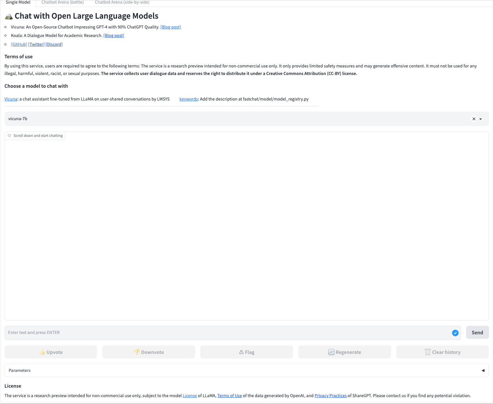

# OPI: Exploring and Benchmarking Large Language Models for Protein Modeling
[](https://github.com/tatsu-lab/stanford_alpaca/blob/main/LICENSE)
[](https://github.com/tatsu-lab/stanford_alpaca/blob/main/DATA_LICENSE)
[](https://github.com/tatsu-lab/stanford_alpaca/blob/main/WEIGHT_DIFF_LICENSE)

## Overview
This repo is for the **Open Protein Instructions (OPI)** project, aiming to build and release a protein instruction dataset as well as propose to explore and benckmark LLMs for protein modeling in protein biology.

**Usage and License Notices:** [LLaMA](https://github.com/facebookresearch/llama) and [Galactica](https://github.com/paperswithcode/galai) are intended and licensed for research use only. The dataset is CC BY NC 4.0 (allowing only non-commercial use) and models trained using the dataset should not be used outside of research purposes. The weight diff for [Stanford Alpaca](https://github.com/tatsu-lab/stanford_alpaca) is also CC BY NC 4.0 (allowing only non-commercial use).

## Our vision and roadmap
***Open Protein Instructions(OPI) is initial part of our Open Biology Instructions(OBI) project, together with the subsequent Open Molecule Instructions(OMI), Open DNA Instructions(ODI) and Open RNA Instructions(ORI). OBI is a project which aims to fully leverage the potential ability of Large Language Models(LLMs), especially the scientific LLMs like Galactica, to facilite research in AI for Life Science community. We hope to reform the way the research is conducted in this community, by bridging LLMs and biology domain konwledge.***

## OPI dataset construction pipeline
The OPI dataset is curated on our own by extracting key informatoin from [Swiss-Prot](https://www.uniprot.org/uniprotkb?facets=reviewed%3Atrue&query=%2A) database. The detailed construction pipeline is depicted in the supplenmentary material of our manuscript which has been submitted to NeurIPS 2023 Datasets and Benchmarks. 

## OPI dataset release
**How to access the OPI dataset?** The OPI dataset can be accessed via this link [OPI_DATA](https://drive.google.com/drive/folders/1l04jJSOb7BrlbtE9Sy9VzUHCQRtOBGiq?usp=drive_link) from Google Drive. 
Once finished downloading the **OPI_DATA** from Google Drive, please put the three subfolders, i.e., AP, KM and SU, into the **OPI_DATA** folder in this repo. 

The **OPI dataset folder structure** is as follows:
```
./OPI_DATA/
├── AP
│   ├── Function
│   │   ├── test
│   │   │   ├── CASPSimilarSeq_function_valid.jsonl
│   │   │   ├── IDFilterSeq_function_valid.jsonl
│   │   │   └── UniProtSeq_function_valid.jsonl
│   │   └── train
│   │       ├── function_description_train.json
│   │       └── function_description_train_0.01.json
│   ├── GO
│   │   ├── test
│   │   │   ├── CASPSimilarSeq_go_valid.jsonl
│   │   │   ├── IDFilterSeq_go_valid.jsonl
│   │   │   └── UniProtSeq_go_valid.jsonl
│   │   └── train
│   │       ├── go_terms_train.json
│   │       └── go_terms_train_0.01.json
│   └── Keywords
│       ├── test
│       │   ├── CASPSimilarSeq_keywords_valid.jsonl
│       │   ├── IDFilterSeq_keywords_valid.jsonl
│       │   └── UniProtSeq_keywords_valid.jsonl
│       └── train
│           ├── keywords_train.json
│           └── keywords_train_0.01.json
├── KM
│   ├── gSymbol2Cancer
│   │   ├── test
│   │   │   └── gene_symbol_to_cancer_new_test.jsonl
│   │   └── train
│   │       └── gene_symbol_to_cancer_new_train.json
│   ├── gName2Cancer
│   │   ├── test
│   │   │   └── gene_name_to_cancer_new_test.jsonl
│   │   └── train
│   │       └── gene_name_to_cancer_new_train.json
│   └── gSymbol2Tissue
│       ├── test
│       │   └── tissue_valid_manner2.jsonl
│       └── train
│           └── tissue_train_manner2.json
└── SU
    ├── EC_number
    │   ├── test
    │   │   ├── CLEAN_EC_number_halogenase_test.jsonl
    │   │   ├── CLEAN_EC_number_new_test.jsonl
    │   │   └── CLEAN_EC_number_price_test.jsonl
    │   └── train
    │       ├── CLEAN_EC_number_split100_train.json
    │       ├── CLEAN_EC_number_split10_train.json
    │       ├── CLEAN_EC_number_split30_train.json
    │       ├── CLEAN_EC_number_split50_train.json
    │       └── CLEAN_EC_number_split70_train.json
    ├── Fold_type-Remote
    │   ├── test
    │   │   └── Remote_valid.jsonl
    │   └── train
    │       └── Remote_train.json
    └── Subcellular_location
        ├── test
        │   ├── location_valid.jsonl
        └── train
            └── location_train.json
```

The **OPI_DATA** folder contains 9 protein tasks seperately. If you want to merge all the 'train.json' files of the nine tasks into one single file, e.g., OPI_full.json, please do like this:
```
cd OPI_DATA
python merge_nine_opi_tasks_train.py --output OPI_full.json
```

Once done, you will get **OPI_full.json**, which is composed of 1,615,661 protein instrucitons. You can also get the [`OPI_full.json`](https://drive.google.com/file/d/1FPg3VtU2nSVx1CnsjJyGCtspBV1ozyjx/view?usp=drive_link) from Google Drive.


## OPI-instruction tuning from original Galactica-6.7B model and LLaMA-7B model
For OPI-instruction tuning, we adopt the training script of [Stanford Alpaca](https://github.com/tatsu-lab/stanford_alpaca). 

### 1. Galactica instruction-tuning with OPI

[Example: train_keywords.sh](./train_galai/train_keywords.sh)
```
#!/bin/bash

OMP_NUM_THREADS=1 torchrun --nnodes=$1 --node_rank=$2 --nproc_per_node=3 train_galai/train.py \
    --model_name_or_path path/to/galactica_base_model/galactica-$3 \
    --data_path  ./OPI_DATA/AP/Keywords/train/keywords_train.json \
    --bf16 True \
    --output_dir path/to/output/galai_ft_opi/galai_ft_keywords_$3_e$4 \
    --num_train_epochs $4 \
    --per_device_train_batch_size 4 \
    --per_device_eval_batch_size 4 \
    --gradient_accumulation_steps 8 \
    --evaluation_strategy "no" \
    --save_strategy "steps" \
    --save_steps 2000 \
    --save_total_limit 1 \
    --learning_rate 2e-5 \
    --weight_decay 0. \
    --warmup_ratio 0.03 \
    --deepspeed "./configs/default_offload_opt_param.json" \
    --tf32 True
```

To start, please do like this:
```
bash train_galai/train_keywords.sh 1 0 6.7b 3 
```

Explanation of such bash arguments:
```
1: nnodes \
0: node_rank \
6.7b: model size of Galactica \
3: total training epochs
```

### 2. LLaMA instruction-tuning with OPI

[Example: train_EC_number.sh](./train_llama/train_EC_number.sh)
```
#!/bin/bash

OMP_NUM_THREADS=1 torchrun --nnodes=$1 --node_rank=$2 --nproc_per_node=3 train_llama/train.py \
    --model_name_or_path path/to/llama_base_model/hf_version/llama-$3 \
    --data_path  ./OPI_DATA/SU/EC_number/train/CLEAN_EC_number_$4_train.json \
    --bf16 True \
    --output_dir path/to/output/llama_ft_CLEAN_EC_number_$4_$3_e$5 \
    --num_train_epochs $5 \
    --per_device_train_batch_size 4 \
    --per_device_eval_batch_size 4 \
    --gradient_accumulation_steps 16 \
    --evaluation_strategy "no" \
    --save_strategy "steps" \
    --save_steps 2000 \
    --save_total_limit 1 \
    --learning_rate 2e-5 \
    --weight_decay 0. \
    --warmup_ratio 0.03 \
    --deepspeed "./configs/default_offload_opt_param.json" \
    --tf32 True
```

To start, please do like this:
```
bash train_llama/train_EC_number.sh 1 0 7b split70 3 
```

Explanation of such bash arguments:
```
1: nnodes \
0: node_rank \
7b: model size of LLaMA \
split70: split number of EC_number training set
3: total training epochs
Note: the argument 'split70' is only suitable to EC_number prdiction task, it is not necesseary for other tasks. 
```

**Note**: As for the training, we take the suggestion to address out-of-memory issue from [tatsu-lab/stanford_alpaca](https://github.com/tatsu-lab/stanford_alpaca), using DeepSpeed ZeRO stage-3 with offload.

### 3. Convert DeepSpeed-format weights
Once finished instruction tuning, the DeepSpeed-format weights should be converted to **pytorch_model.bin**, using the following script:
```
cd output_dir
python zero_to_fp32.py . pytorch_model.bin
```

### 4. Split pytorch_model.bin into chunks to speedup loading for inference
After step 3, you will get the **pytorch_model.bin** file. You can further split it to small chunks, e.g., pytorch_model-00001-of-00004.bin
pytorch_model-00002-of-00004.bin, pytorch_model-00003-of-00004.bin, pytorch_model-00004-of-00004.bin, in order to speedup loading it when inferenceing. However, it is not a must, if you don't want. If you would like to split it, please do like this:
```
cd model_split
python model_split.py --model_idx OPI-instruction-tuned-model-name
```
Then you will get a checkpoint folder suffixed with "**chunked**", which you can take as the **pretrained model path** for later evaluation job.

### 5. How to access OPI-instruction-tuned Galactica-6.7B model?
In this repo, we release the OPI-Galactica-6.7B model for the task **Function Keywords Prediction**, which can be accessed from [Google Drive](https://drive.google.com/drive/folders/1Q0UtH0o5tKC1BDcvm0KXsCeZz3Ja-HQ6?usp=drive_link) and [HuggingFace](...). Please feel free to contact us for other task-oriented models.

## Evaluation tasks

For benchamarking, we design 3 types of evaluation tasks, each of which contains 3 specific ones, as shown in the following table.

| Task Type                     | Task Name                              |
| ----------------------------- | -------------------------------------- |
| Sequence Understanding        |EC Number Prediction         |
| Sequence Understanding        |Fold Type Prediction         |
| Sequence Understanding        |Subcellular Localization Prediction  |
| Annotation Prediction         |Function Keywords Prediction         |
| Annotation Prediction         |Gene Ontology(GO) Terms Prediction   |
| Annotation Prediction         |Function Description Prediction      |
| Knowledge Mining              |Tissue Location Prediction from Gene Symbol  |
| Knowledge Mining              |Cancer Prediction from Gene Symbol   |
| Knowledge Mining              |Cancer Prediction from Gene Name     |

## Evaluation with OPI-instruction-tuned models
For the evaluation script, we refer to the inference script from [Chinese-LLaMA-Alpaca](https://github.com/ymcui/Chinese-LLaMA-Alpaca).

### 1. Evaluation of Galactica
We evaluate OPI-instruction-tuned Galactica-6.7B model and origional Galactica-6.7B model.

**For OPI-instruction-tuned Galactica-6.7B model, please use the following script:**
```
cd eval_galai
python eval_galai.py --model_idx OPI-instruction-tuned-model-name --gpus=0
```

**For the original Galactica-6.7B model, please use the following script:**
```
cd eval_galai/infer_with_original_galai
bash galactica_infer.sh
```

### 2. Evaluation of Alpaca
For comparison, we evaluate Alpaca-7B model and [Galpaca-6.7B](https://huggingface.co/GeorgiaTechResearchInstitute/galpaca-6.7b) model. The Galpaca-6.7B model is contributed by Georgia Tech Research Institute on HuggingFace.

As for Alpaca-7B model, we first get [alpaca-7b-wdiff](https://huggingface.co/tatsu-lab/alpaca-7b-wdiff) from HuggingFace, which is the weight diff for [Stanford Alpaca-7B](https://github.com/tatsu-lab/stanford_alpaca/), then recover the original Alpaca-7B weights using the conversion script provided by [tatsu-lab/stanford_alpaca](https://github.com/tatsu-lab/stanford_alpaca).

The same script is used for evaluating Alpaca-7B and Galpaca-6.7B model, just by setting a different model_idx for a different model.
```
cd eval_alpaca
python eval_alpaca.py --model_idx alpaca-7b-recover --gpus=0 #original Alpaca-7B weights
```

### 3. Evaluation of LLaMA
For comparison, we evaluate OPI-instruction-tuned LLaMA-7B model and original LLaMA-7B model.

The same script is used for evaluating OPI-instruction-tuned LLaMA-7B model and original LLaMA-7B model, just by setting a different model_idx for a different model.
```
cd eval_llama
python eval_llama.py --model_idx llama_7b_hf --gpus=0  #original LLaMA-7B weights
```

## Demo
We use the [FastChat](https://github.com/lm-sys/FastChat) platform for our demo.

